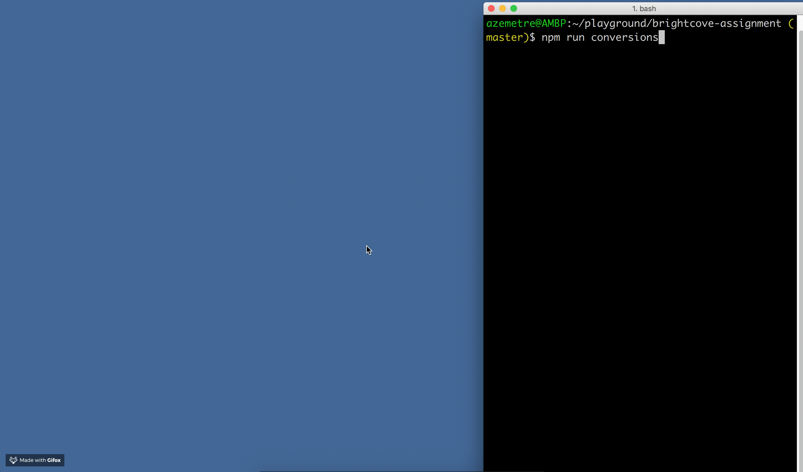

## Simple Currency Converter

A simple HTML page that converts currencies.

You can view the live version of this repo at:

http://aaronzemetres.me/portfolio/brightcove-assignment/

#### How to run tests

Tests are built with [selenium-webdriver](https://www.npmjs.com/package/selenium-webdriver), [mocha](https://www.npmjs.com/package/mocha), [chai](https://www.npmjs.com/package/chai), and [chai-as-promised](https://www.npmjs.com/package/chai-as-promised)

Before running the test scripts please make sure that **chrome driver is in your path**

[instructions for OS X](http://www.kenst.com/2015/03/installing-chromedriver-on-mac-osx/)

Install npm dependencies for tests

```$ npm i```

To run the UI tests use the npm script:

```$ npm run conversions```

Example of a successful test run.



### Ways to improve app and testing

#### Improving the app

New features to allow the user to choose the date and currencies converted can be included.

This can be done by using input elements. These values can be extracted and put into a template literal for the fetch API to use.

#### Tests

UI tests, written in selenium, can be improved using better async techniques like promises and generators to allow for speedier tests.

UI tests can also be more encompassing, including testing on sessionStorage keys.

A small series of smoke tests can be created testing the headers, text, and stylings.

Since the HTML page is so basic UI tests can be dismissed in favor of unit tests. There are only 4 functions in use. Testing code logic can be done using the same tooling as the UI tests, mocha and chai.

